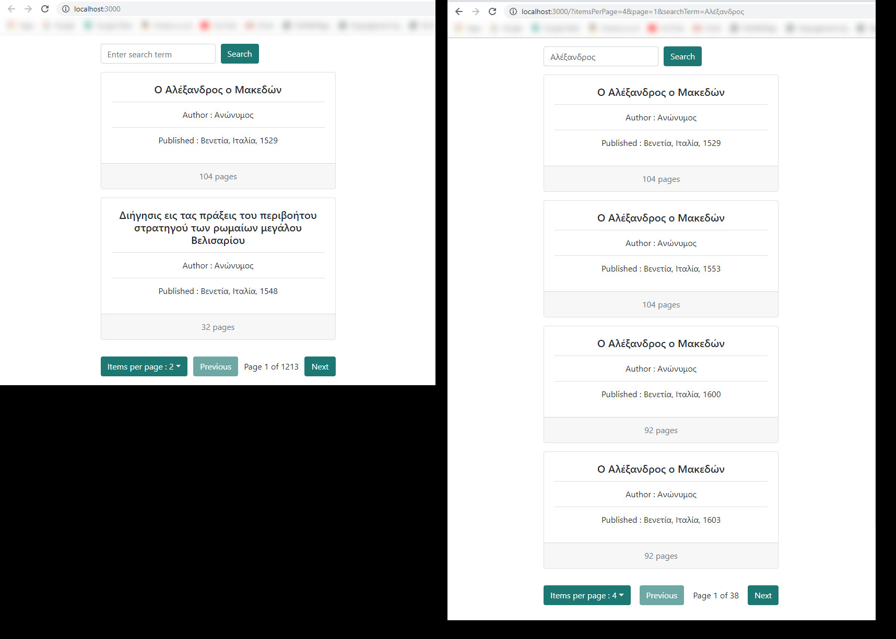

Two screenshots of the app :

Thank you for this opportunity and for this interesting task

Notes:

To run this app, after you clone this repo locally, do :

`npm install`

followed by :

`npm start`

Then you can see this app in a browser in the following url :

`http://localhost:3000/`

